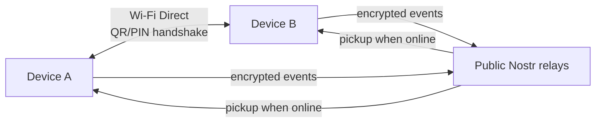

# f-tree Family Network — Baseline Spec (v1)

Sep 19, 2026 · @arjun

## Goals & non-goals

Extend f-tree with location-aware stats, a fun-facts layer, and an async family trivia game — while keeping the app's existing no-accounts, no-server, offline-first posture intact everywhere except the one place that genuinely needs the internet (remote sync after the first in-person pairing).

**Non-goals:**

- No analytics or telemetry, ever
- No central account system or login
- No server-side data retention beyond ephemeral relay pass-through (relays hold encrypted blobs only, briefly)
- No live/synchronous multiplayer — the facts game is async by design
- No defense against a stolen, unlocked phone — that's out of scope for this baseline

## Baseline feature scope

Built together as one release, no phasing:

| Feature | What it adds |
| --- | --- |
| Relationship distance | Optional location field per person; haversine distance shown on the relationship-path screen |
| Fun-facts panel | Shared birth month, age gap, zodiac, hometown — computed from existing data, no new fields |
| Portraits on relationship path | Reuses existing avatar assets and path-computation already built for the storybook feature |
| Family calendar | Aggregates birthdays/anniversaries; optional local notifications |
| Migration map | Plots birthplaces using the same location field as distance |
| Proximity pairing | Extends the existing `nearby/` Wi-Fi Direct module with a QR/PIN trust handshake and keypair exchange |
| Identity recovery | Web-of-trust: restore your identity on a new phone by re-pairing with any one existing trusted relative |
| Remote sync | After first pairing, ongoing sync over public Nostr relays (NIP-17/44/59), E2E encrypted |
| Facts game | Self-answer or guess-about-someone-else, async, with points and owner-resolved conflicts |
| Optional messaging | Direct encrypted messages, but only between people who've done an in-person pairing with each other directly |

## Architecture overview

Existing baseline: Kotlin 2.3, Jetpack Compose, Room DB, Android 8.0+, desktop via Windows installer/.deb. Core logic (kinship rules, chart layout, duplicate matching) is written as pure functions tested on the JVM. Today only two modules open a socket — `update/` (one-shot GitHub release check) and `nearby/` (local Wi-Fi Direct transfer) — kept isolated on purpose so that's auditable by reading, not by trust. `.ftree` exports stay forward-compatible: unknown fields are ignored.

Four new layers sit on top of that:

1. **Trust layer** — each person gets a long-term keypair generated on-device. First pairing extends `nearby/`: two devices exchange public keys over Wi-Fi Direct, verified by a QR code or short PIN shown on each screen so the verification happens face to face, not over a network.
2. **Sync layer** — after pairing, facts/guesses/points/tree edits are wrapped as NIP-17 gift-wrapped events and published to 2–3 public Nostr relays. No self-hosted relay required.
3. **Recovery layer** — identity rotation events, detailed in Identity, pairing & recovery.
4. **Game layer** — async facts/points logic, written the same pure-function way as the rest of the core.

Proximity does the trust bootstrap once; every sync after that rides the internet through relays that never see plaintext.

## Data model / schema

Proposed new Room entities layered on top of the existing Person/relationship graph (exact existing field names weren't verified against source — reconcile before implementation).

**PersonLocation** — one row per person per location type

| Field | Type | Notes |
| --- | --- | --- |
| personId | FK |  |
| label | enum | birthplace / current |
| lat, lon | double | resolved once via offline geocode |
| source | enum | manual / geocoded |
| updatedAt | timestamp |  |
| sharingEnabled | boolean | Global per-person toggle, not per-contact — hides all location rows for that person when off |

**TrustedContact** — the local trust store

| Field | Type | Notes |
| --- | --- | --- |
| personId | FK |  |
| pubKeyCurrent | text | active Nostr pubkey |
| pubKeyHistory | list | superseded keys, kept for audit |
| pairedAt | timestamp |  |
| pairingMethod | enum | direct / vouched |
| vouchedByPersonId | FK, nullable | set only for a vouched pairing |

**IdentityRotationEvent** — the recovery record

| Field | Type | Notes |
| --- | --- | --- |
| personId | FK | whose identity moved |
| oldPubKey, newPubKey | text |  |
| vouchedByPubKey | text | the relative who re-paired |
| signature | text | signed by vouchedByPubKey |
| timestamp | timestamp |  |

**Fact / FactAnswer / FactResolution** — the game's core

| Field | Type | Notes |
| --- | --- | --- |
| Fact.id, personId, category, prompt | — | who the fact is about |
| FactAnswer.factId, answererId, answerText, isSelfReported, submittedAt | — | every answer kept, never overwritten |
| FactResolution.factId, winningAnswerId, resolvedByPersonId, pointsAwarded | — | resolvedByPersonId is always the fact owner |

**PointsLedger** — personId, points, reasonFactId, awardedAt

**SyncOutbox** — local retry queue since relays are best-effort: eventId, payloadEncrypted, targetPubKeys, relayUrls, publishedAt, ackedBy

**RewardRedemption** — the real-world payoff

| Field | Type | Notes |
| --- | --- | --- |
| id | — |  |
| fromPersonId, toPersonId | FK | who owes whom |
| rewardType | enum | beer / coffee / ice cream / custom |
| pointsThreshold | int | configurable per relationship |
| status | enum | owed / redeemed |
| redeemedAt | timestamp, nullable | either side marks it settled once it happens in person |

## Identity, pairing & recovery

**Threat model (confirmed):** relay operators are honest-but-curious, not malicious. Physical proximity at pairing time is the trust anchor — it's what proves identity. A stolen, unlocked phone is explicitly out of scope: whoever holds it can act as that person until the key is revoked.

**First pairing:** Wi-Fi Direct session (extends `nearby/`) where both devices exchange public keys, verified by a QR code or short PIN shown on each screen — verification happens face to face, so a remote attacker can never spoof it later.

**Recovery (web-of-trust):** losing a phone doesn't mean losing your identity in the network.

1. The new device generates a fresh keypair.
2. The person re-pairs in person, using the same proximity flow, with any one relative who already trusts them.
3. That relative's device issues a signed identity-rotation attestation: "Person P moved from key X to key Y, attested by relative R at time T."
4. The attestation propagates through the Nostr sync layer. Any device that already trusts R accepts the rotation and updates its record for P.
5. The old key is marked revoked; anything signed by it afterward is rejected network-wide.

**Decision — single-vouch recovery, no extra confirmation:** a vouching relative's word is sufficient on its own. No additional confirmation is required from the person being recovered or from anyone else in the network before the rotation takes effect. A single point of trust is accepted by design — if the vouching relative is ever fooled in person, the network would silently trust the impostor. Reasonable for a low-stakes hobby app; revisit if the app ever holds anything higher-stakes.

## Optional messaging

Direct encrypted messaging between any two people, gated to pairs who've done an in-person proximity handshake with each other specifically — not extended automatically through vouched, network-transitive trust.

- Reuses the transport already chosen for sync: NIP-17 gift-wrapped, NIP-44 encrypted direct messages over the same relays — no new infrastructure.
- Enabled only when `TrustedContact.pairingMethod` is `direct` for that specific pair. A `vouched` relationship (e.g. a cousin who trusts you only because a third relative vouched for your key rotation) doesn't unlock messaging on its own — they'd still need to meet you in person first.
- Tied to the person, not the device: once two people have met once, messaging between them survives later key rotations on either side — no need to re-meet after a phone change.
- Schema: a `MessageThread` (keyed on the pair of personIds) and `Message` (threadId, senderId, body, sentAt, deliveryStatus), stored locally the same way facts and points are.

## Facts game mechanics

Fully async — no live/synchronous multiplayer. A prompt is shown, and the player chooses to answer it about themselves or guess it about a relative.

**Conflict resolution rule (as specified):**

- Every answer is kept — a self-report and any number of guesses about the same fact all persist, none are overwritten.
- The most recent answer is shown as the fact's default display value.
- The fact owner (the person the fact is about) gets a resolution card listing every answer submitted, and picks the correct one; the resolution card surfaces automatically the next time they open the app — no timeout, no auto-resolution.
- Whoever submitted the answer chosen as correct is awarded points.

**Points & rewards:** points aren't spent in-app — they accumulate toward a real-world payoff the recipient redeems in person (a beer, a coffee, an ice cream). Reward type and point threshold are configurable per relationship; either side can mark a redemption settled once it actually happens.

**Starter question bank** — modeled on Kahoot-style "how well do you know me" decks and family-reunion trivia banks, kept to light categories only:

| Category | Example prompt |
| --- | --- |
| Food | What's my go-to pizza topping? |
| Growing up | What was my first pet's name? |
| Family history | What country did our great-grandparents emigrate from? |
| Family traditions | What dish do I always bring to reunions? |
| Milestones | Who's the oldest living member of the family right now? |
| Guess the story | Who got lost on a family trip and turned up hours later eating ice cream? |
| Everyday habits | What do I do in the first five minutes after waking up? |

**Open question:** whether a wrong guess costs anything, or the game is pure upside with no penalty — not yet decided (see Open questions & risks).

## App store & compliance notes

| Area | Status |
| --- | --- |
| Encryption export (Apple) | AES/ECDH used only for authentication/data protection — standard exemption applies; still requires answering the Export Compliance questionnaire each submission |
| Encryption (Google Play) | No export gate; declared in the Data Safety form |
| Android BLE permission | Request `BLUETOOTH_SCAN` with `neverForLocation` — avoids the location-permission prompt for the proximity handshake |
| iOS | No iOS build currently exists — proximity pairing only works Android-to-Android until/unless one is built; a real limitation for mixed-platform families |
| Third-party personal data | Not a policy issue — standard genealogy-app pattern (Ancestry, FamilySearch, Geni all do this) |
| Minors' birthdates | Fine — not a children's app, no COPPA trigger |
| Licensing | MIT-licensed baseline — no copyleft constraints on forking or rebranding |
| Distribution | Google Play (decided). F-Droid is not a target, so prebuilt native libraries (secp256k1) are acceptable |

## Open questions & risks

- **Threshold-of-one recovery risk** — accepted as designed; revisit if the app ever holds higher-stakes data.
- **Relay reliability** — Nostr relays are best-effort. Mitigated by publishing to multiple relays plus the local SyncOutbox retry queue, but not a durable guarantee.
- **No fallback if nobody's reachable** — DECIDED: there is no recovery path for someone with no relative nearby. Web-of-trust recovery needs at least one existing contact to re-pair with; without one, a lost phone means a new identity. No key backup is planned.
- **Wrong-guess scoring** — DECIDED: a wrong guess costs nothing. The game is pure upside.
- **Fork relationship to upstream** — contribute back to `thisisankit27/f-tree`, or diverge as an independent rebrand? Affects MIT attribution and how much of this stays a PR vs. a separate project.
- **No iOS build** — DECIDED: Android-to-Android only for now.
